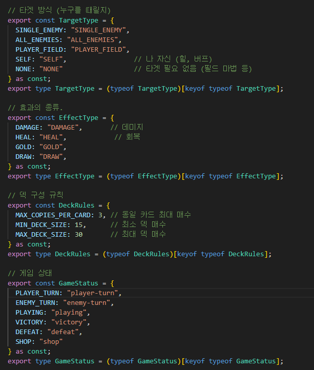

# 🎮 로그라이크 싱글 카드 게임 (Card Game)

TypeScript와 React를 활용하여 개발한 **로그라이크 싱글 카드 게임** 프로젝트입니다. 턴제 전략 요소와 로그라이크의 무작위성이 결합된 던전 탐험형 게임입니다.

개발인원: 1인
개발기간: 2026.1.22 ~ 2026.1.31(10일)

## 🛠 주요 기술 스택

* **Language**: TypeScript (Shared 패키지를 통한 클라이언트-서버 타입 공유)
* **Frontend**: React, Vite, React Router
* **Backend**: Node.js, Socket.IO (TypeScript 기반의 실시간 게임 서버 구축)

## ✨ 프로젝트 핵심 특징

### 기술적 설계

* **모노레포 구조**: 프로젝트에서 TypeScript만이 사용돼 코드가 일관적이며, 클라이언트와 서버에서 사용하는 공통 타입으로 dto없이, 단순하고 직관적인 코드가 특징입니다.
<br/>


(백엔드와 프론트엔드 양쪽에서 사용하는 타입)

* **Socket.IO 기반 실시간 통신**: 서버와 클라이언트 간의 모든 이벤트를 Socket을 사용해 실시간 양방향 통신을 구현했습니다.


### 로그라이크 게임 시스템

* **50라운드 챌린지**: 플레이어는 총 50라운드 동안 무작위로 생성되는 적 몬스터를 상대하며 살아남아야 합니다.
* **영구적인 상태 유지**: 전투가 끝나도 소환된 몬스터와 플레이어의 체력은 자동으로 회복되지 않으며, 전투 중 입은 피해가 다음 라운드까지 지속되어 전략적인 체력 관리가 필요합니다.
* **상점 시스템**: 전투 종료 후 획득한 금화로 새로운 카드를 구매하거나, 플레이어 및 몬스터의 체력을 회복하여 전력을 강화할 수 있습니다.

### 전략적인 전투 메커니즘

* **금화 경제 체제**: 기본 5개의 금화로 시작하며, 몬스터 소환 시 코스트를 소모합니다. 적을 물리치면 해당 몬스터의 코스트만큼 금화를 획득하는 보상 체계를 갖추고 있습니다.
* **필드 구성**: 플레이어와 적 각각 최대 5칸의 몬스터 존을 가지며, 카드 패(Hand)는 최대 5장으로 제한되어 효율적인 자원 운용이 중요합니다.


## 🕹 게임 페이지 구성

1. **메인 페이지**: 게임 시작, 덱 구성, 설정 메뉴 제공
2. **덱 빌더**: 최대 20장의 카드로 자신만의 전략적인 덱 구성
3. **게임 보드**: 실시간 전투가 이루어지는 메인 인터페이스 (몬스터 존, 묘지, 덱, 체력 및 금화 표시)
4. **상점**: 라운드 사이의 정비 및 카드 확충

---

**실행 방법**

```bash
# 루트 디렉토리에서 실행 (클라이언트와 서버 동시 실행)
npm run dev

```